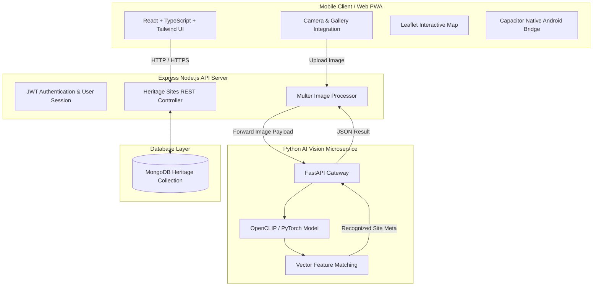

# AI Tourist Guide — Mobile Experience

[](https://react.dev/)
[](https://www.typescriptlang.org/)
[](https://vitejs.dev/)
[](https://tailwindcss.com/)
[](https://nodejs.org/)
[](https://www.mongodb.com/)
[](https://pytorch.org/)
[](https://capacitorjs.com/)

**AI Tourist Guide** is an intelligent, AI-powered cultural heritage companion designed for mobile devices. Powered by deep visual recognition (**OpenCLIP / PyTorch**), interactive maps, immersive audio guides, and localized storytelling, AI Tourist Guide transforms smartphone cameras into living tour guides for temples, stupas, and UNESCO World Heritage sites.


---

## Key Features

- **AI Visual Monument Recognition** — Scan any temple, stupa, or historical monument using your camera or gallery upload. Zero-shot visual classification powered by OpenCLIP identifies heritage sites instantly.
- **Interactive Heritage Map** — Explore nearby historical landmarks using interactive Leaflet map overlays, live distance markers, and custom category filter chips.
- **AI Audio Guide & Companion** — Interactive voice-guided walkthroughs with real-time cultural Q&A assistant ("Ara", the Himalayan Guardian Spirit).
- **Cultural Storytelling** — Generates deep historical narratives, mythologies, architectural insights, and visitor tips for recognized sites.
- **Digital Passport & Achievements** — Earn virtual stamps, collect heritage badges, and track your site visits across UNESCO landmarks.
- **Offline Mode & Data Packs** — Downloadable regional heritage packs for exploring remote historical areas without an active cellular connection.
- **Cross-Platform Native Mobile & PWA** — Runs seamlessly as a progressive web app (PWA) with native mobile device camera integration, or builds directly into a native Android APK via Capacitor.

---

## System Architecture



---

## Tech Stack

### Frontend & Mobile
- **Core**: React 18, TypeScript, Vite 6
- **Styling**: Tailwind CSS v4, Motion (Framer Motion), Lucide Icons
- **Mapping**: Leaflet & React-Leaflet
- **Native Wrapper**: Capacitor Android (`@capacitor/android`, `@capacitor/cli`)

### Node.js Backend API
- **Runtime**: Node.js & Express
- **Database**: MongoDB & Mongoose
- **Authentication**: JSON Web Tokens (JWT) & bcryptjs
- **File Storage**: Multer multipart form handling

### Python AI Vision Service
- **Framework**: FastAPI & Uvicorn
- **AI Core**: PyTorch & OpenCLIP (`open_clip_torch`)
- **Image Processing**: Pillow (PIL)

---

## Folder Structure

This project is organized as a **monorepo** with three isolated service directories.

```
AI Tourist Guide/                        ← Monorepo root
├── .gitignore
├── .vscode/
├── README.md
├── pnpm-workspace.yaml                  ← Workspace config (frontend + backend)
│
├── frontend/                            ← React / Ionic Capacitor App
│   ├── android/                         ← Capacitor native Android project
│   ├── public/                          ← Static assets (icons, APK download)
│   ├── dist/                            ← Production build output
│   ├── src/
│   │   ├── main.tsx                     ← App entry point
│   │   ├── app/
│   │   │   ├── App.tsx                  ← Root router
│   │   │   ├── components/
│   │   │   │   ├── common/              ← Reusable UI (Buttons, Cards, NavBar)
│   │   │   │   ├── figma/               ← Figma-synced design components
│   │   │   │   └── ui/                  ← Base design system primitives
│   │   │   ├── constants/               ← Static data, onboarding, site images
│   │   │   ├── context/                 ← AuthContext state provider
│   │   │   ├── screens/                 ← Domain screen modules
│   │   │   │   ├── auth/                ← Splash, Onboarding, Login, Register
│   │   │   │   ├── explore/             ← Map, Directory, Search
│   │   │   │   ├── home/                ← Main Dashboard
│   │   │   │   ├── scan/                ← Camera Scanner, AI Processing, Result
│   │   │   │   ├── site/                ← Site Details, AI Story, Audio Guide
│   │   │   │   ├── system/              ← Offline Mode, Error View
│   │   │   │   └── user/                ← Profile, History, Achievements, Settings
│   │   │   ├── services/
│   │   │   │   └── api.ts               ← API client (Axios/fetch wrappers)
│   │   │   └── types/
│   │   │       └── screen.ts            ← TypeScript screen interfaces
│   │   └── styles/                      ← Global CSS & Tailwind imports
│   ├── index.html
│   ├── vite.config.ts                   ← Vite + basicSSL + proxy config
│   ├── postcss.config.mjs
│   ├── capacitor.config.json
│   ├── default_shadcn_theme.css
│   └── package.json
│
├── backend/                             ← Node.js / Express REST API
│   ├── src/
│   │   ├── config/
│   │   │   └── db.js                    ← MongoDB connection
│   │   ├── controllers/
│   │   │   ├── authController.js
│   │   │   ├── heritageController.js
│   │   │   ├── recognitionController.js
│   │   │   └── storyController.js
│   │   ├── middleware/
│   │   │   ├── authMiddleware.js        ← JWT verification
│   │   │   └── errorMiddleware.js       ← Global error & 404 handler
│   │   ├── models/
│   │   │   ├── HeritageSite.js
│   │   │   ├── User.js
│   │   │   └── VisitHistory.js
│   │   ├── routes/
│   │   │   ├── authRoutes.js
│   │   │   ├── heritageRoutes.js
│   │   │   ├── recognitionRoutes.js
│   │   │   └── storyRoutes.js
│   │   └── services/
│   │       ├── aiService.js             ← Calls Python AI microservice
│   │       └── storyService.js          ← AI story generation logic
│   ├── server.js                        ← Express entry point (Port 5001)
│   ├── .env                             ← Secret config (not committed)
│   ├── .env.example                     ← Example env template
│   └── package.json
│
└── ai/                                  ← Python OpenCLIP Vision Microservice
    ├── core/
    │   ├── clip_model.py                ← OpenCLIP model loader
    │   ├── embedding.py                 ← Feature extraction
    │   └── matcher.py                   ← Cosine similarity matcher
    ├── data/
    │   ├── heritage.json                ← Heritage site reference data
    │   └── images/                      ← Reference image assets
    ├── database/
    │   └── embeddings.pkl               ← Pre-computed site embeddings
    ├── scripts/
    │   └── create_embeddings.py         ← Embedding generation script
    ├── main.py                          ← FastAPI server entry point (Port 8000)
    ├── requirements.txt                 ← Python dependencies
    └── pyrightconfig.json
```

---

## Quick Start Guide

### Prerequisites
- **Node.js**: `v18.x` or higher
- **Python**: `3.9` or higher (for AI microservice)
- **MongoDB**: Local MongoDB instance or MongoDB Atlas connection string

---

### 1. Clone the Repository

```bash
git clone https://github.com/krishal77/cation-1.git
cd "AI Tourist Guide"
```

---

### 2. Configure Environment Variables

Copy the example env file and fill in your values:

```bash
cp backend/.env.example backend/.env
```

**`backend/.env`:**
```env
PORT=5001
MONGODB_URI=mongodb://localhost:27017/culture_guide_ai
JWT_SECRET=your_jwt_secret_key_here
AI_SERVICE_URL=http://localhost:8000
```

---

### 3. Start the Services

#### A. Node.js Backend Server
```bash
cd backend
npm install
node server.js
```
*(Runs on `http://localhost:5001`)*

#### B. Python AI Vision Microservice *(optional — for visual recognition)*
```bash
cd ai
python3 -m venv venv
source venv/bin/activate       # Windows: venv\Scripts\activate
pip install -r requirements.txt
python main.py
```
*(Runs on `http://localhost:8000`)*

#### C. React Frontend Application
```bash
cd frontend
npm install
npm run dev
```
*(Runs on `https://localhost:5173` — self-signed SSL is auto-generated for mobile camera access)*

---

## Mobile Deployment & Testing

### Option 1: Mobile Browser PWA (Instant Wi-Fi Access)
1. Run `npm run dev` inside `frontend/`.
2. Open the network URL shown in terminal (e.g. `https://192.168.1.x:5173/`) in **Chrome** (Android) or **Safari** (iOS).
3. Accept the local self-signed SSL warning (required for Web Camera API over local Wi-Fi).
4. Tap **"Add to Home Screen"** to install as a standalone app.

### Option 2: Native Android APK (via Capacitor)
```bash
# From inside the frontend/ directory:
npm run build
npx cap sync android
npx cap open android
```
Then build or run the APK from Android Studio.

---

## Verification & Building

To type-check and build the production bundle:
```bash
cd frontend
npm run build
```

To verify the backend is running:
```bash
curl http://localhost:5001/health
```
Expected response: `{"status":"ok","service":"culture-guide-express-server",...}`

---

## License

This project is licensed under the [MIT License](LICENSE).
