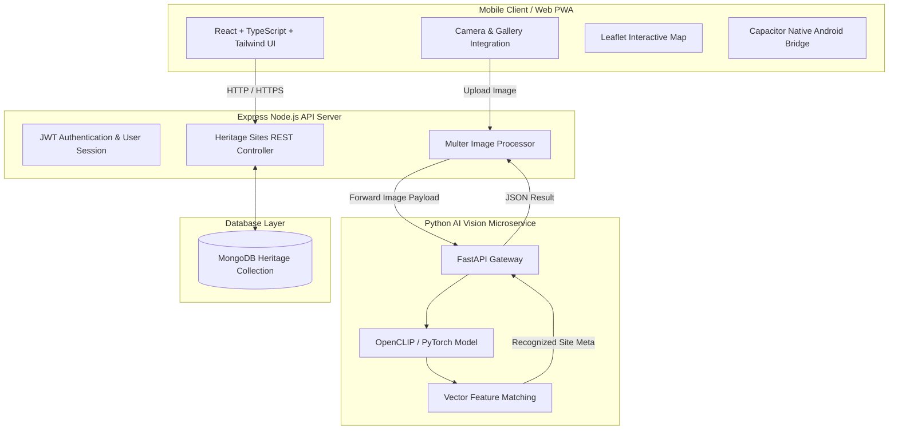

# 🏛️ AI Tourist Guide — Mobile Experience

[](https://react.dev/)
[](https://www.typescriptlang.org/)
[](https://vitejs.dev/)
[](https://tailwindcss.com/)
[](https://nodejs.org/)
[](https://www.mongodb.com/)
[](https://pytorch.org/)
[](https://capacitorjs.com/)

**AI Tourist Guide** is an intelligent, AI-powered cultural heritage companion designed for mobile devices. Powered by deep visual recognition (**OpenCLIP / PyTorch**), interactive maps, immersive audio guides, and localized storytelling, AI Tourist Guide transforms smartphone cameras into living tour guides for temples, stupas, and UNESCO World Heritage sites.

---

## 🌟 Key Features

- 📸 **AI Visual Monument Recognition**: Scan any temple, stupa, or historical monument using your camera or gallery upload. Zero-shot visual classification powered by OpenCLIP identifies heritage sites instantly.
- 🗺️ **Interactive Heritage Map**: Explore nearby historical landmarks using interactive Leaflet map overlays, live distance markers, and custom category filter chips.
- 🎧 **AI Audio Guide & Companion**: Interactive voice-guided walkthroughs with real-time cultural Q&A assistant ("Ara", the Himalayan Guardian Spirit).
- 📜 **Cultural Storytelling**: Generates deep historical narratives, mythologies, architectural insights, and visitor tips for recognized sites.
- 🎖️ **Digital Passport & Achievements**: Earn virtual stamps, collect heritage badges, and track your site visits across UNESCO landmarks.
- 📶 **Offline Mode & Data Packs**: Downloadable regional heritage packs for exploring remote historical areas without an active cellular connection.
- 📱 **Cross-Platform Native Mobile & PWA**: Runs seamlessly as a progressive web app (PWA) with native mobile device camera integration, or builds directly into a native Android APK via Capacitor.

---

## 🏗️ System Architecture



---

## 🛠️ Tech Stack

### Frontend & Mobile
- **Core**: React 18, TypeScript, Vite 6
- **Styling**: Tailwind CSS v4, Motion (Framer Motion), Lucide Icons
- **Mapping**: Leaflet & React-Leaflet
- **Native Wrapper**: Capacitor Android (`@capacitor/android`, `@capacitor/cli`)

### Node.js Backend API
- **Runtime**: Node.js & Express
- **Database**: MongoDB & Mongoose
- **Authentication**: JSON Web Tokens (JWT) & bcryptjs
- **File Storage**: Multer multipart form handling

### Python AI Vision Service
- **Framework**: FastAPI & Uvicorn
- **AI Core**: PyTorch & OpenCLIP (`open_clip_torch`)
- **Image Processing**: Pillow (PIL)

---

## 📁 Folder Structure

```
AI Tourist Guide/
├── src/                          # Modular React / TypeScript App
│   ├── app/
│   │   ├── components/common/   # Reusable UI components (Buttons, Cards, NavBar, PhoneFrame)
│   │   ├── constants/           # Static data, onboarding slides & site images
│   │   ├── context/             # AuthContext state provider
│   │   ├── screens/             # Modular domain views
│   │   │   ├── auth/            # Splash, Onboarding, Login, Register
│   │   │   ├── explore/         # Map, Directory Explorer, Search
│   │   │   ├── home/            # Main Dashboard
│   │   │   ├── scan/            # Camera Scanner, AI Processing, Result View
│   │   │   ├── site/            # Site Details, AI Story, Audio Guide
│   │   │   ├── system/          # Offline Mode, Error View
│   │   │   └── user/            # Saved, History, Achievements, Profile, Settings
│   │   ├── services/            # API client service methods
│   │   ├── types/               # TypeScript interfaces & screen unions
│   │   └── App.tsx              # Application Root Router
│   └── styles/                  # Global CSS & Tailwind imports
├── server/                      # Node.js Express REST Backend
│   ├── controllers/             # Authentication & Heritage Controllers
│   ├── models/                  # MongoDB Schemas (User, Site, Visit)
│   ├── routes/                  # Express Router endpoints
│   └── server.js                # Server entry point (Port 5001)
├── ai-service/                  # Python OpenCLIP Microservice
│   ├── core/                    # OpenCLIP feature extraction engine
│   ├── data/                    # Heritage site reference embeddings
│   ├── main.py                  # FastAPI server entry point
│   └── requirements.txt         # Python dependencies
├── android/                     # Capacitor Native Android Project
│   └── app/src/main/            # Android Manifest & Native Assets
├── capacitor.config.json        # Capacitor configuration
├── vite.config.ts               # Vite bundler & basicSSL HTTPS config
└── package.json                 # Web dependencies & build scripts
```

---

## 🚀 Quick Start Guide

### Prerequisites
- **Node.js**: `v18.x` or higher
- **Python**: `3.9` or higher (for AI microservice)
- **MongoDB**: Local MongoDB instance or MongoDB Atlas connection string

---

### 1. Clone & Install Frontend Dependencies

```bash
git clone https://github.com/krishal77/cation-1.git
cd "AI Tourist Guide"

# Install frontend packages
npm install
```

---

### 2. Configure Environment Variables

Create `.env` files in both backend and AI service directories:

**Backend (`server/.env`):**
```env
PORT=5001
MONGODB_URI=mongodb://localhost:27017/culture_guide_ai
JWT_SECRET=your_jwt_secret_key_here
AI_SERVICE_URL=http://localhost:8000
```

---

### 3. Start the Services

#### A. Node.js Backend Server
```bash
cd server
npm install
npm run dev
```
*(Runs on `http://localhost:5001`)*

#### B. Python AI Vision Microservice (Optional for offline AI testing)
```bash
cd ai-service
python3 -m venv venv
source venv/bin/activate  # On Windows: venv\Scripts\activate
pip install -r requirements.txt
python main.py
```
*(Runs on `http://localhost:8000`)*

#### C. React Frontend Application
```bash
# In the root directory:
npm run dev
```
*(Runs on `https://localhost:5173` or local Wi-Fi IP `https://192.168.x.x:5173` with auto-generated SSL for mobile browser camera support)*

---

## 📱 Mobile Deployment & Testing

### Option 1: Mobile Browser PWA (Instant Wi-Fi Access)
1. Run `npm run dev` on your computer.
2. Open the network URL displayed in terminal (e.g. `https://192.168.1.106:5173/`) in **Chrome** (Android) or **Safari** (iOS).
3. Accept the local self-signed SSL warning (required for Web Camera access over local Wi-Fi).
4. Tap **"Add to Home Screen"** or **"Install App"** in your browser menu to run standalone!

### Option 2: Native Android APK (via Capacitor)
```bash
# Build the production bundle & sync with native Android project
npm run build
npx cap sync android

# Open project in Android Studio to build .apk or deploy directly
npx cap open android
```

---

## 🧪 Verification & Building

To verify TypeScript static types and build the production bundle:

```bash
npm run build
```

---

## 📄 License

This project is licensed under the [MIT License](LICENSE).
